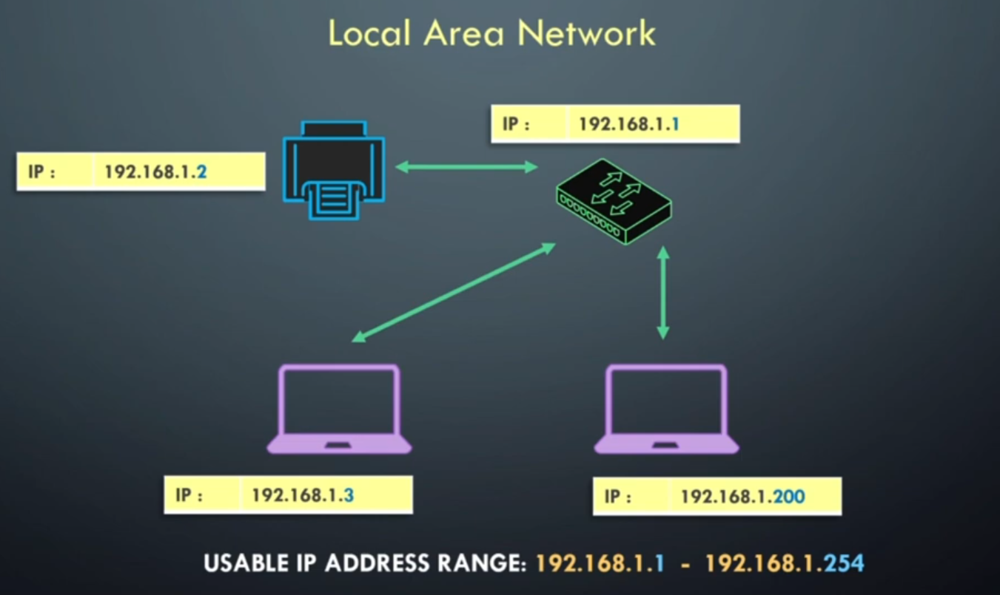

# TCP / IP

TCP (Transmission Control Protocol) is a communication protocol to ensure data is sent and received accurately between devices.

It's a list of rules/standards which are divided into layers.

## Protocols Layers

| Layer Number | Protocol       | What it concerns                                                                 |
| :-----------:|:--------------:|:--------------------------------------------------------------------------------:|
| Layer 4      | Application    | End-user softaware: web browsers, email clients, etc.                            |
| Layer 3      | Transport      | Ports: TCP (80 (HTTP), 443 (HTTPS), 25 (SMTP)), UDP (53 (DNS), 67 (DHCP))        |
| Layer 2      | Internet       | IP Adressing and routing                                                         |
| Layer 1      | Physical       | Physical transmission of data: eg. via Ethernet cables                           |

## LAN

A LAN (Local Area Network) and had a network of devices talking to each others within a limited range.

For eg. your home network has multiples devices talking to each others, like the PC to the printer.

## IP

IP (Internet Protocol) is the logical address of a device in the network allocated by a router.

It helps identifie and locate a device on a LAN. It also allows devices to communicate with each others.

Each device has its unique IP address:
- IPv4 (32-bit): eg. *192.168.1.1*
- IPv6 (128 bit): eg. *2001:0db8:85a3:0000:0000:8a2e:0370:7334*

### IPv4
The IPv4 is seperated between 4 octets:

| 192. 168. 1.     | 1.           |
|:----------------:|:------------:|
| Network Portion  | Host Portion |

### Host
A host is a device like a phone or a computer for eg.
It will always be assigned a usable IP address.

### Network IP Addresses
There are always 2 IP addresses reserved in a network:
1. Network Address (first IP of the network)  
	**192.168.1.0**
2. Broadcast Address (last IP of the network)  
	**192.168.1.255**

Usable IP range:
192.168.1.**1** - 192.168.1.**254**

Here is an example of a LAN:  

